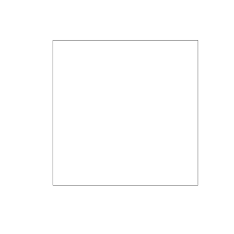

Example of issue with excessive whitespace and mismath between interactive and programmatic saving of plots with `sp::plot()`.  

Simple square polygon:  

```r
square <- readWKT('POLYGON((-1 -1,-1 1,1 1,1 -1, -1 -1))')
```

Plot:  

```r
par(mar=c(0, 0, 0, 0)) # no margins
plot(square, axes = F)
```

Saving this plot interactively using Export button in RStudio with width and height set to 400px yields:  


Saving with dev.print gives the same plot:  

```
dev.print(png, 'data/dev-print-400x400.png', width = 400, height = 400)
```

  

But, printing directly to `png()` device gives a huge amount of whitespace:  

```
png('data/png-dev-400x400.png', width = 400, height = 400)
plot(square, axes = F)
dev.off()
```

